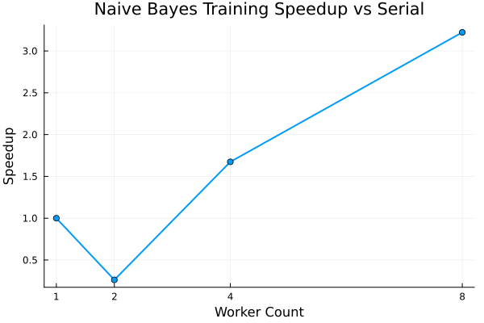

# Abstract

This project began as a 2023 proposal to build a performant Julia NLP pipeline for Kaqchikel Maya using TF-IDF and Naive Bayes. The original task framing was sentiment analysis, but manual sentiment labeling became the primary blocker. The wrap-up in 2026 reframes the task to avoid that bottleneck while preserving the original computational goals: classify **classical** Kaqchikel Chronicle text versus **modern** written Kaqchikel from the Tang/Bennett corpus. The final pipeline is implemented in Julia, includes reproducible data preparation, hand-rolled multinomial Naive Bayes, character trigram and word unigram TF-IDF features, and serial-vs-threaded timing experiments. On a balanced 8,026-sample dataset (6,420 train / 1,606 test), unigram TF-IDF reaches 94.3% test accuracy and character trigrams reach 98.9%. An ablation reported below shows that the character trigram advantage is **orthographic rather than linguistic**: the two source corpora encode the glottal stop differently, and normalizing that single convention collapses trigram accuracy to 94.4%, indistinguishable from the word unigram baseline. This closes the class project with working code, measurable outputs, a documented label-leakage failure mode, and a clearer path to future work in modern low-resource NLP.

# NLP Pipeline

# Context and Related Work

Kaqchikel NLP is no longer empty space. Recent work includes MayaVoice (Spanish<->14 Mayan MT) [@regalado2025mayavoice], FLORES+ Mayas benchmark/dataset construction [@floresmayas2025], and broad low-resource shared tasks through AmericasNLP [@degibert2025americasnlp]. Monolingual baselines now exist as well, including Goldfish models for `cak_latn` [@chang2026goldfish].  

However, the specific corpus used in this project (Kaqchikel Chronicles) remains useful as a historical register resource and as a compact testbed for reproducible Julia-based methods.

# Corpora and Data Constraints

Two corpora are used:

1. **Kaqchikel Chronicle / Kiwujil text** (classical register) [@maxwell2006chronicles]
2. **Tang/Bennett written corpus** (modern register) [@tang2018predictability; @bennett2018stop]

The Tang/Bennett readme explicitly disallows redistribution, so this repository stores only:

- local path configuration,
- sentence index manifests,
- aggregate metrics.

No Tang/Bennett text is committed.

# Why the Task Was Reframed

The original sentiment-labeling objective was not completed in 2023. The previous CSV had a placeholder bug (`Sentiment = String` on almost all rows), making supervised sentiment training impossible without major annotation effort.  

For project completion, the label is generated from data provenance:

- `classical` if sentence source is Chronicle,
- `modern` if sentence source is Tang/Bennett.

This preserves the main computational objective (TF-IDF + Naive Bayes + parallelization) while removing manual labeling dependency.

# Procedure

1. Regenerate Chronicle CSV from source text (`Sentence` only).
2. Load Tang/Bennett corpus locally and filter lines by token count.
3. Build a balanced sample between classes.
4. Create a stratified train/test split (seed = 42).
5. Build feature matrices:
   - word unigram TF-IDF (TextAnalysis.jl),
   - character trigram TF-IDF (custom sparse construction).
6. Train hand-rolled multinomial Naive Bayes (Laplace smoothing).
7. Evaluate on held-out test set.
8. Benchmark serial vs threaded feature extraction and training (`src/benchmark.jl`).
9. Run an orthographic ablation to test whether the feature advantage is linguistic (`src/confound_check.jl`).

# Parallel Naive Bayes Classifier

$$P(c|x) = P(x|c) * P(c) / P(x)$$ 

The implementation follows the standard multinomial Naive Bayes formulation with log priors and log likelihoods, and applies worker-level parallelism during aggregation of per-class feature statistics, inspired by prior parallel NB literature [@amazal2018parallelnb].

# Results

## Data Preparation Summary

- Chronicle rows after regeneration: **4013**
- Modern rows after filtering: **43535**
- Balanced dataset: **8026**
- Split: **6420 train / 1606 test**

## Classification Performance

- **Word unigram TF-IDF + multinomial NB**: 0.9433 test accuracy
- **Character trigram TF-IDF + multinomial NB**: 0.9894 test accuracy
- **TextAnalysis.jl `NaiveBayesClassifier` cross-check**: 0.9900 test accuracy

The cross-check trains an independent implementation on raw text and lands within
0.001 of the hand-rolled character trigram model, so the 0.9894 figure is not an
artifact of the custom sparse construction. The class boundary is genuinely
separable. The next section establishes *what* separates it, which turns out not
to be register.

## The Character Trigram Advantage Is Orthographic

The 4.6-point gap between character trigrams and word unigrams invites a
linguistic reading: trigrams capture Kaqchikel morphology that whitespace
tokenization misses. That reading is wrong, and the diagnostic in
`src/confound_check.jl` shows why.

All 20 top discriminative trigrams in `train_metrics.json` contain either U+2019
(right single quotation mark) or a comma, and all 20 favour `classical`. The two
corpora turn out to use nearly disjoint orthographic conventions:

| Corpus | U+2019 | U+0027 | Commas | All punct. |
|---|---|---|---|---|
| Chronicle | 15,982 | 171 | 3,355 | 3,610 |
| Tang/Bennett | 0 | 269,074 | 0 | 0 |

Both corpora mark the glottal stop at almost the same rate (73.1 vs 67.6
apostrophes per 1,000 characters), so the segment itself is not distinctive. Only
its *encoding* is. The Chronicle writes it curly, Tang/Bennett writes it
straight, and Tang/Bennett has been stripped of every other punctuation mark.
Curly-share divergence between the corpora is 0.989 out of a possible 1.0.

Because the labels are derived from provenance, and provenance perfectly predicts
encoding, any character trigram containing U+2019 or a comma is a flawless
`classical` detector. This is label leakage through the digitization pipeline.

Retraining the character trigram model under three normalization regimes
isolates the effect:

| Regime | Accuracy | Punct. in top 50 |
|---|---|---|
| A. Raw (as originally reported) | 0.9894 | 50/50 |
| B. Apostrophes folded to U+0027 | 0.9440 | 39/50 |
| C. Folded, punctuation stripped | 0.9259 | 6/50 |
| *word unigram baseline* | *0.9433* | — |

Regime B preserves the glottal stop as a linguistic segment and changes only its
encoding. That alone erases the entire advantage: 0.9440 against a word unigram
baseline of 0.9433, a difference of 0.0007. Regime C, which approximates what the
word path sees after `strip_punctuation`, falls to 0.9259 — *below* the word
baseline. Once orthographic cues are removed, character trigrams are slightly
worse than word unigrams on this task.

The defensible claim is therefore narrower than the headline number: classical
and modern Kaqchikel registers are separable at roughly 94% with either feature
set, and the apparent 98.9% is a measurement of which file a sentence was
digitized into.

## Benchmark Summary (8-thread run)

Timings are medians of 30 BenchmarkTools samples on the 6,420-row training split
(feature matrix 6,420 × 7,442, 387,213 nonzeros), with an explicit warmup call
per configuration so that compilation is never inside the sample set.

| Workers | Features (s) | Speedup | NB train (s) | Speedup |
|---|---|---|---|---|
| 1 | 0.16166 | 1.00x | 0.004849 | 1.00x |
| 2 | 0.13305 | 1.22x | 0.004861 | 1.00x |
| 4 | 0.11139 | 1.45x | 0.004875 | 0.99x |
| 8 | 0.09693 | 1.67x | 0.005123 | 0.95x |

An earlier version of this benchmark used `@elapsed` with no warmup and reported
Naive Bayes training falling from 0.0251s serial to 0.0078s at 8 workers, a
~3.2x speedup. That result does not survive proper measurement. `@elapsed` timed
the *first* call through each code path, so the serial number absorbed
compilation of the serial path and the threaded numbers absorbed compilation of
the `@spawn` path. The same flaw produced an apparent 0.26x "slowdown" at 2
workers, which was JIT latency rather than scheduling overhead.

With warmup excluded, **Naive Bayes training does not benefit from worker-level
parallelism at all**, and degrades slightly at 8 workers. This is Amdahl's law
rather than measurement noise. Only one region of `train_multinomial_nb` is
parallelized — the per-class accumulation of `feature_sums` over the 387,213
nonzeros — while two serial regions dominate the runtime: the
`sparse(transpose(X))` materialization and the dense
`n_classes × n_features` log-likelihood loop (2 × 7,442 logarithms). Allocation
counts confirm the overhead is real, rising from 37 allocations and 6.5 MB at one
worker to 114 allocations and 7.5 MB at eight.

Feature extraction does scale, because chunked trigram counting is genuinely
independent per document, but sublinearly: 1.67x on 8 threads. The per-chunk
`Dict{String,Int}` merge is serial and grows with worker count, which caps the
achievable speedup. Reducing that merge cost, for example by hashing trigrams to
integer IDs and accumulating into preallocated arrays, is the obvious next
optimization and would benefit both stages.

# Contributions to Julia Text Ecosystem

The project also contributed Kaqchikel support to `Languages.jl` through PR #43 (initial addition) and PR #46 (trigram fix), making language detection support practical for downstream Julia NLP workflows.

# Discussion

This project demonstrates an important lesson for low-resource NLP: **labeling is not always the right first bottleneck to solve**.  

When labels are expensive, useful alternatives include:

- weak labels from source metadata (used here),
- self-supervised objectives,
- multilingual transfer from related languages.

The ablation adds a second lesson, and a sharper one: **weak labels derived from
provenance leak provenance.** Because every `classical` example came from one
file and every `modern` example from another, any incidental difference between
those files — encoding, punctuation policy, transcription era, editorial
convention — becomes a free feature. Character n-grams are especially exposed,
since they see exactly the surface detail that tokenization would discard. The
word unigram path scored lower here precisely because TextAnalysis
`strip_punctuation` happened to delete the leaking characters, which means the
"weaker" feature set was the more honest one.

The practical safeguard is cheap: before interpreting a margin between feature
sets, normalize the orthography and re-measure. A gap that vanishes under
encoding normalization was never linguistic. For this corpus pair, that check
costs one function and a few seconds of compute, and it changes the conclusion.

A third lesson concerns performance measurement. The parallel speedup originally
reported here was an artifact of timing first calls in a JIT-compiled language.
Warmup is not a refinement in Julia benchmarking; without it, the measurement can
invert the sign of the result.

For future work, Python/Hugging Face tooling is likely better for modern LLM workflows, while Julia remains an effective environment for transparent, reproducible algorithmic baselines and performance experiments.

# References

Citations are maintained in `paper/paper.bib`.
